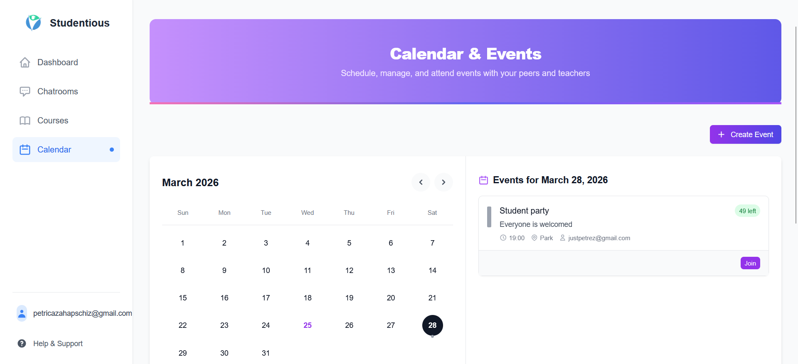
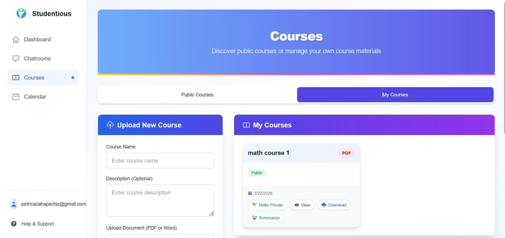
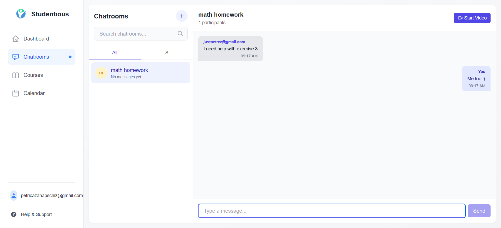
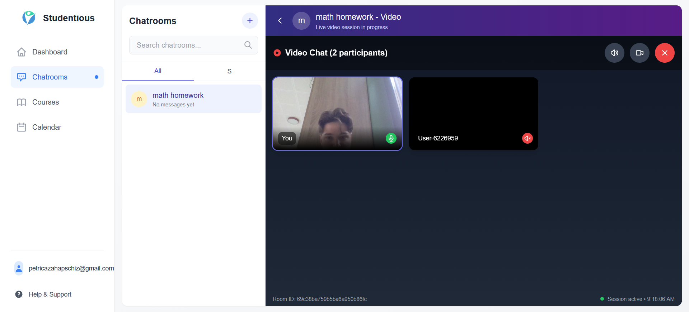

## 📱 Screenshots & Demo

  A visual tour of the Studentious platform, showing the dashboard, course materials, and collaboration features.

<table border="0">
  <tr>
    <td align="center" valign="top" colspan="2">
      <h3>📚 Platform Dashboard & Course Management</h3>
    </td>
  </tr>
  <tr>
    <td align="center">
      
       <em>Calendar & Events View</em>
    </td>
    <td align="center">
      
       <em>Course Material Management</em>
    </td>
  </tr>

  <tr>
    <td align="center" valign="top" colspan="2">
       <h3>🗣️ Real-Time Collaboration & Communication</h3>
    </td>
  </tr>
  <tr>
    <td align="center">
      
       <em>Live Community Chatrooms</em>
    </td>
    <td align="center">
      
       <em>Video Conferencing via Agora</em>
    </td>
  </tr>
</table>

## **🚀 Key Features**

* **Custom Authentication & Roles:** Cookie-based session management with distinct access levels for students and teachers.  
* **AI Content Pipeline:** Automatically generates summaries for uploaded course documents (PDF/Word) and translates them into multiple languages.  
* **Text-to-Speech (ElevenLabs):** Converts AI summaries into high-quality audio files for on-the-go listening.  
* **Real-Time Video & Chat:** Features community chatrooms powered by WebSockets/MongoDB and live video conferencing integrated via Agora.  
* **Smart Notifications:** Automated email notifications and recommendations handled by background cron jobs (node-cron).  
* **Performance Optimized:** Includes session caching and API endpoint protection (AuthGuard).

## **🛠️ Tech Stack**

* **Framework:** Next.js (Pages Router)  
* **Frontend:** React, Tailwind CSS  
* **Backend:** Node.js API Routes, custom useAuth() hook  
* **Database:** MongoDB (with Mongoose/clientPromise)  
* **Real-Time & Video:** Socket.IO (planned/alternative), Agora.io (Video Chat)  
* **AI & External APIs:** Google Generative AI (Summarization), ElevenLabs API (Audio), Translation API  
* **Other Tools:** pdf-lib (Document handling), node-cron (Schedulers)

## **⚙️ Getting Started**

Follow these steps to run the project locally.

### **1\. Clone the repository**

git clone \[https://github.com/PetricaZPC/studentious.git\](https://github.com/PetricaZPC/studentious.git)  
cd studentious

### **2\. Install dependencies**

npm install

### **3\. Set up Environment Variables**

Create a .env.local file in the root of the project and add the necessary API keys and database URIs:  
\# Database  
MONGODB\_URI=your\_mongodb\_connection\_string

\# Authentication & Sessions  
JWT\_SECRET=your\_jwt\_secret\_key

\# External APIs  
ELEVENLABS\_API\_KEY=your\_elevenlabs\_key  
AGORA\_APP\_ID=your\_agora\_app\_id  
AGORA\_APP\_CERTIFICATE=your\_agora\_certificate  
AI\_API\_KEY=your\_ai\_translation\_and\_summary\_key

### **4\. Run the development server**

npm run dev

Open [http://localhost:3000](https://www.google.com/search?q=http://localhost:3000) with your browser to see the result.
